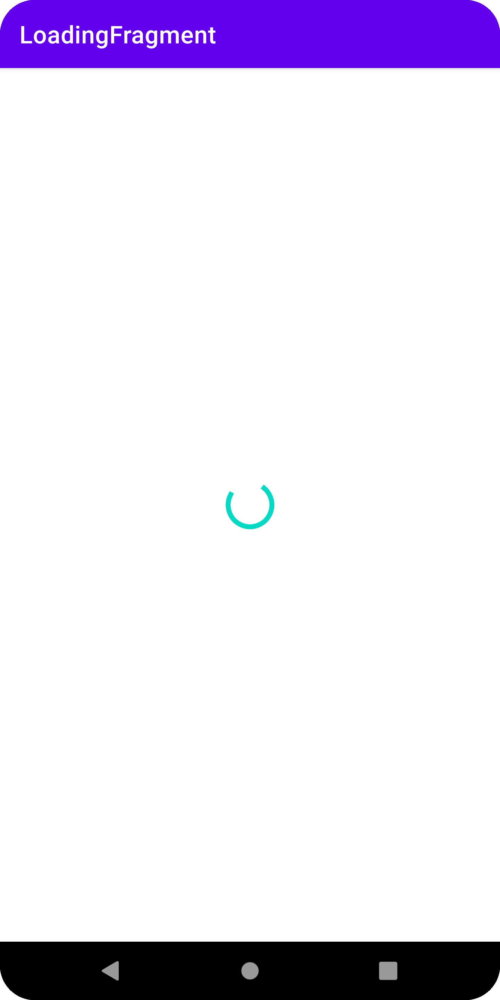
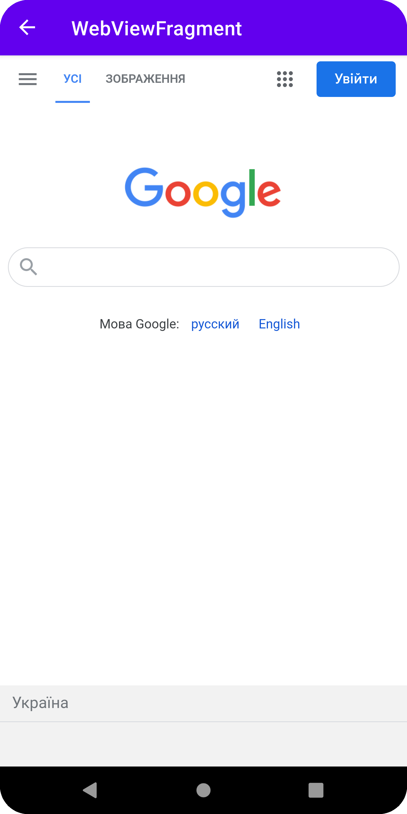

Разработать приложение под android используя kotlin. Приложение должно состоять из двух экранов: экран загрузки и экран с webview. Для экранов необходимо использовать фрагменты, не активити.
При запуске приложения отобразить экран загрузки и сделать get запрос на сервер https://efs5i1ube5.execute-api.eu-central-1.amazonaws.com/prod.
Как только придет ответ - необходимо остановить загрузку и открыть экран с webview. В webview необходимо запустить ссылку "link" если это первый запуск приложения или открыть ссылку "home" если webview с "link" уже запускалось до этого.

Дополнительно:

Сделано:
1. Добавить возможность возвращаться назад по webview при нажатии кнопки назад.
2. Сохранить параметры, которые присылает сервер и использовать их при последующих запусках.
3. Запускать приложение в режиме full-screen, скрывая system ui.
4. Установить любую иконку приложения.

Не сделано:
1. Добавить поддержку переворота экрана (режимы portrait и landscape) без перезапуска webview и сохранением состояния.

